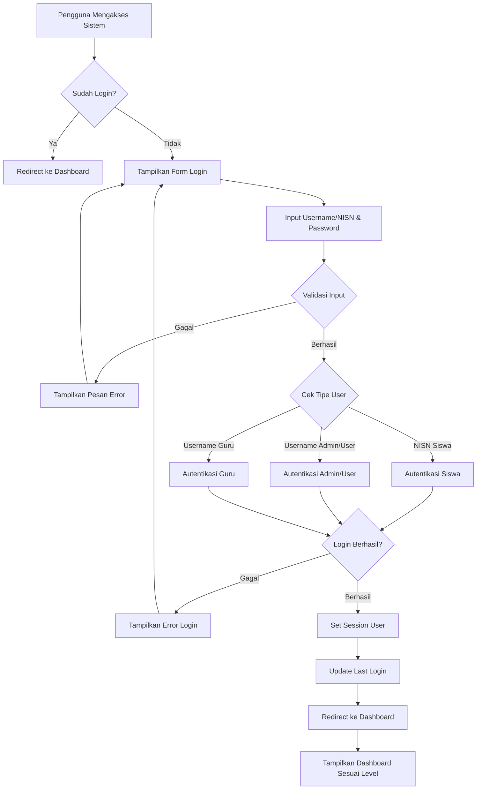
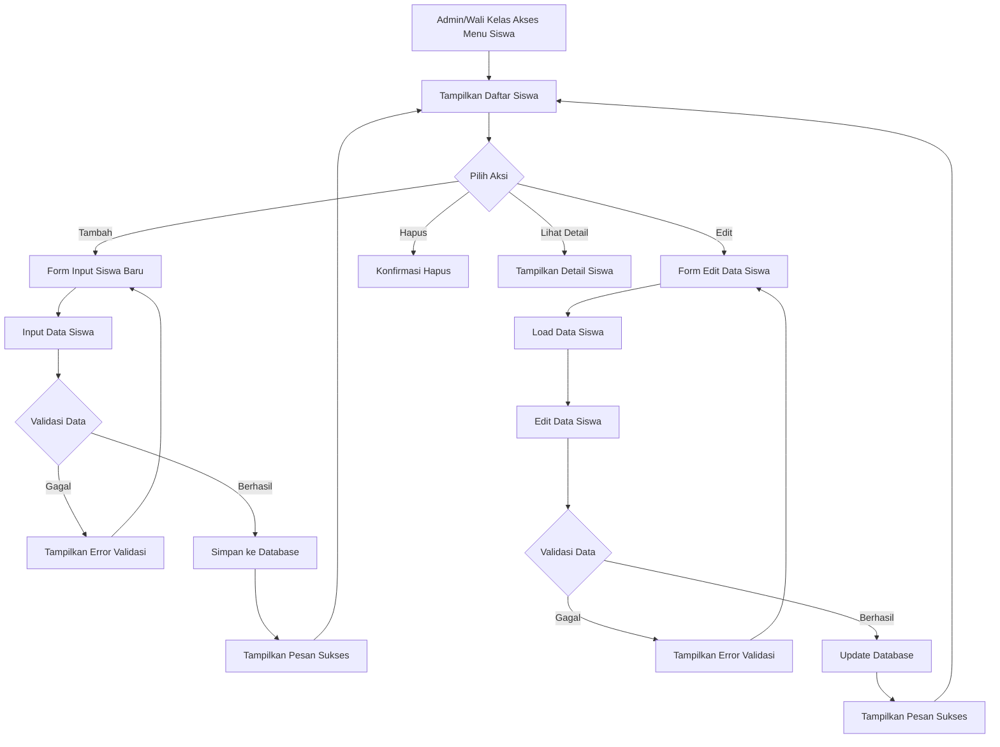
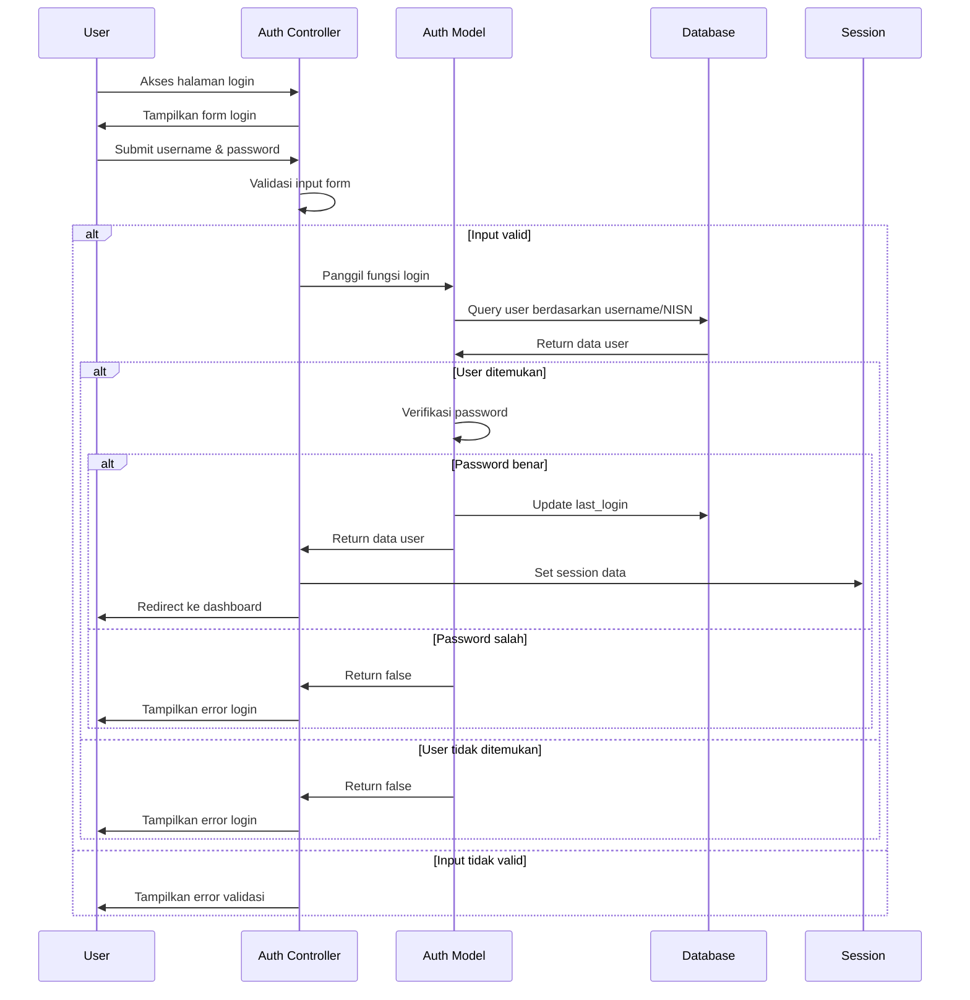
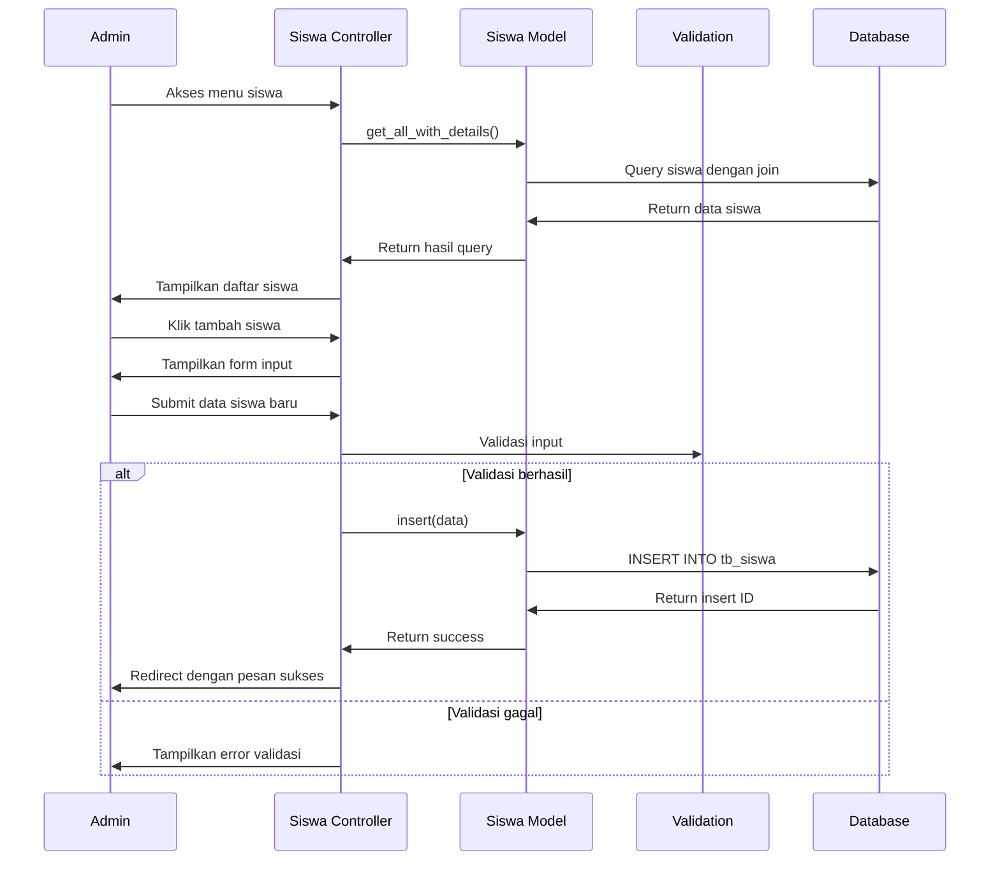
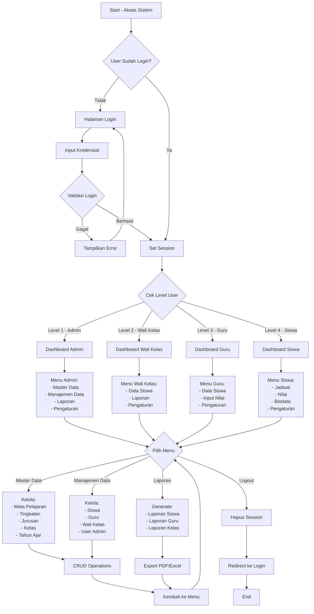
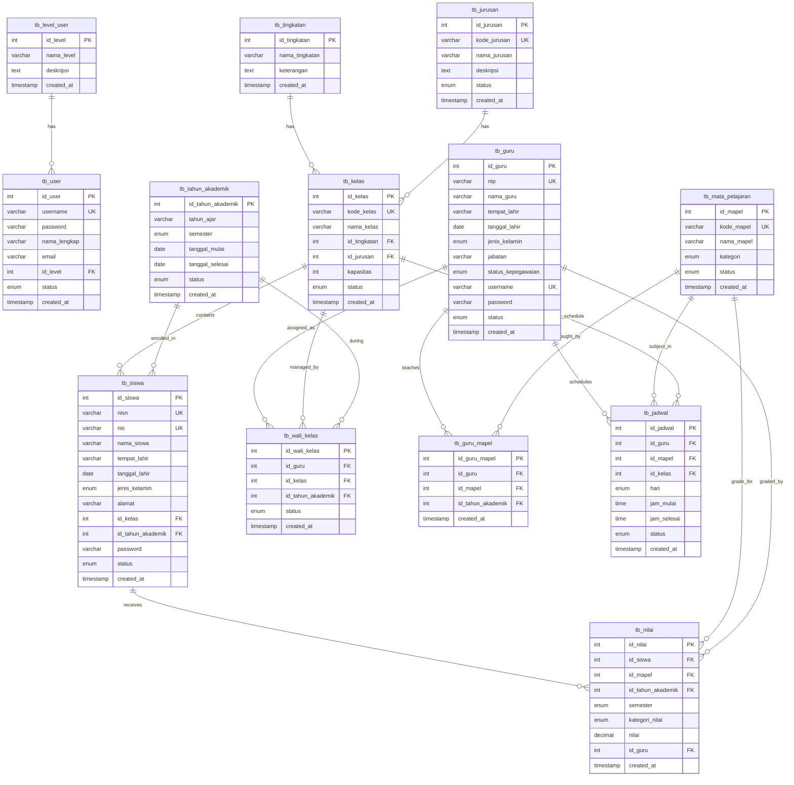
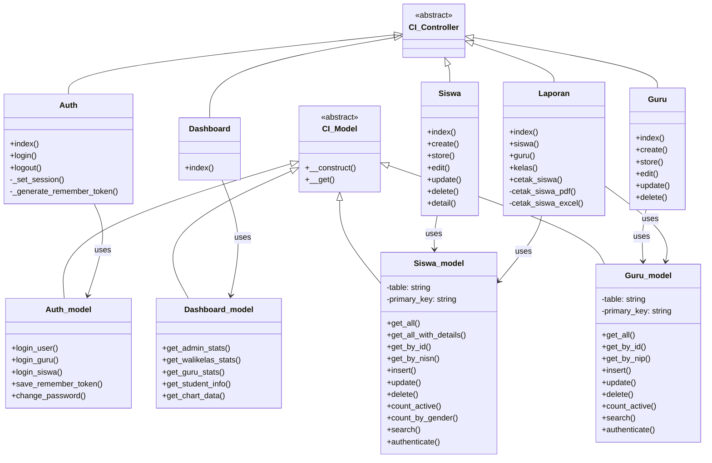

# SISFO SMK Bina Mandiri
## Sistem Informasi Sekolah SMK Bina Mandiri

### Deskripsi Sistem
SISFO SMK Bina Mandiri adalah sistem informasi sekolah berbasis web yang dibangun menggunakan framework CodeIgniter 3. Sistem ini dirancang untuk mengelola data akademik sekolah menengah kejuruan meliputi manajemen siswa, guru, kelas, nilai, dan laporan.

### Teknologi yang Digunakan
- **Backend Framework**: CodeIgniter 3.x
- **Database**: MySQL 
- **Frontend**: Bootstrap 5, HTML5, CSS3, JavaScript
- **Library**: FPDF (PDF Generation), Chart.js (Visualisasi Data)
- **Server**: Apache (XAMPP)
- **Bahasa Pemrograman**: PHP 7.2+

---

## Diagram Aktivitas Sistem (Activity Diagram)

### 1. Diagram Aktivitas Login Sistem



### 2. Diagram Aktivitas Manajemen Data Siswa



---

## Diagram Urutan (Sequence Diagram)

### 1. Sequence Diagram Proses Login



### 2. Sequence Diagram CRUD Data Siswa



---

## Diagram Alir Sistem (Flowchart)

### Flowchart Sistem Keseluruhan



---

## Diagram Hubungan Entitas (ERD)



---

## Diagram Kelas (Class Diagram)



---

## Arsitektur Sistem

### Struktur MVC (Model-View-Controller)

```
┌─────────────────────────────────────────────┐
│           PRESENTATION LAYER                │
├─────────────────────────────────────────────┤
│  Views (Bootstrap 5, Chart.js, DataTables) │
└─────────────────────────────────────────────┘
                    │
                    ▼
┌─────────────────────────────────────────────┐
│           BUSINESS LOGIC LAYER              │
├─────────────────────────────────────────────┤
│  Controllers (Auth, Dashboard, Siswa, dll)  │
│  - Authentication & Authorization          │
│  - Input Validation                        │
│  - Business Rules                          │
│  - Report Generation                       │
└─────────────────────────────────────────────┘
                    │
                    ▼
┌─────────────────────────────────────────────┐
│           DATA ACCESS LAYER                 │
├─────────────────────────────────────────────┤
│  Models (Auth_model, Siswa_model, dll)     │
│  - Database Operations                     │
│  - Data Validation                         │
│  - Query Optimization                      │
└─────────────────────────────────────────────┘
                    │
                    ▼
┌─────────────────────────────────────────────┐
│           DATABASE LAYER                    │
├─────────────────────────────────────────────┤
│  MySQL Database                            │
│  - 15+ Tables                              │
│  - Relational Structure                    │
│  - Indexes & Views                         │
└─────────────────────────────────────────────┘
```

## Fitur Utama Sistem

### 1. Manajemen Pengguna
- **Multi-level Authentication**: Admin, Wali Kelas, Guru, Siswa
- **Role-based Access Control**: Akses menu sesuai level pengguna
- **Session Management**: Auto-logout, remember me functionality
- **Password Management**: Ubah password, validasi keamanan

### 2. Manajemen Data Master
- **Data Mata Pelajaran**: CRUD mata pelajaran umum dan kejuruan
- **Data Tingkatan**: Kelola tingkatan kelas (X, XI, XII)
- **Data Jurusan**: Manajemen jurusan sekolah (RPL, TKJ, MM, dll)
- **Data Kelas**: Pembentukan kelas berdasarkan tingkatan dan jurusan
- **Tahun Akademik**: Pengaturan tahun ajaran dan semester

### 3. Manajemen Data Operasional
- **Data Siswa**: Registrasi, biodata lengkap, penempatan kelas
- **Data Guru**: Profil guru, mata pelajaran yang diampu
- **Wali Kelas**: Penugasan wali kelas per tahun ajaran
- **Jadwal Pelajaran**: Penjadwalan mata pelajaran
- **Input Nilai**: Sistem penilaian siswa

### 4. Sistem Laporan
- **Laporan Siswa**: Filter berdasarkan kelas, jurusan
- **Laporan Guru**: Data guru dan mata pelajaran
- **Laporan Kelas**: Informasi kelas dan wali kelas
- **Export Data**: Format PDF dan Excel
- **Statistik Dashboard**: Visualisasi data dengan Chart.js

### 5. Dashboard Multi-Level
- **Dashboard Admin**: Statistik lengkap, manajemen sistem
- **Dashboard Wali Kelas**: Data kelas yang diampu
- **Dashboard Guru**: Jadwal mengajar, mata pelajaran
- **Dashboard Siswa**: Jadwal pelajaran, nilai, biodata

---

## Instalasi dan Konfigurasi

### Requirements
- PHP 7.2 atau lebih tinggi
- MySQL 5.7 atau lebih tinggi
- Apache Web Server
- XAMPP (Recommended)

### Langkah Instalasi
1. Clone repository ke direktori `htdocs/sisfo`
2. Import database dari file `database_sisfo.sql`
3. Konfigurasi database di `application/config/database.php`
4. Akses sistem melalui `http://localhost/sisfo`
5. Login default: **admin** / **admin123**

### Struktur Database
Sistem menggunakan 15+ tabel utama dengan relasi yang terstruktur:
- **Master Tables**: tingkatan, jurusan, mata_pelajaran, tahun_akademik
- **User Tables**: user, guru, siswa, level_user
- **Operational Tables**: kelas, wali_kelas, guru_mapel, jadwal, nilai
- **System Tables**: menu, user_access, audit_log

---

*Dokumentasi ini dibuat untuk memberikan pemahaman menyeluruh tentang arsitektur dan fungsionalitas Sistem Informasi Sekolah SMK Bina Mandiri.*